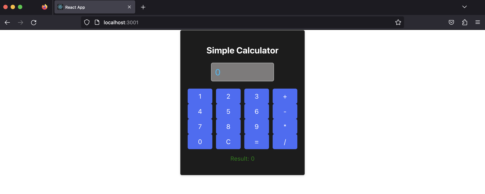

# Simple Calculator Application using ReactJS
Developed this Simple Calculator application for a one-hour long session on ReactJS to introduce junior year students of RV College of Engineering, Bangalore, India to ReactJS and its core concepts.

By creating a Simple Calculator application, students got to explore various React features, including functional components, React hooks (such as useState), handling user input, and displaying the result. It also introduced them to the concept of managing the state of the application and handling events triggered by user interactions.

[Slides used for the session](https://github.com/rohis06/SimpleCalc/blob/main/slides/ReactJS.pdf)

